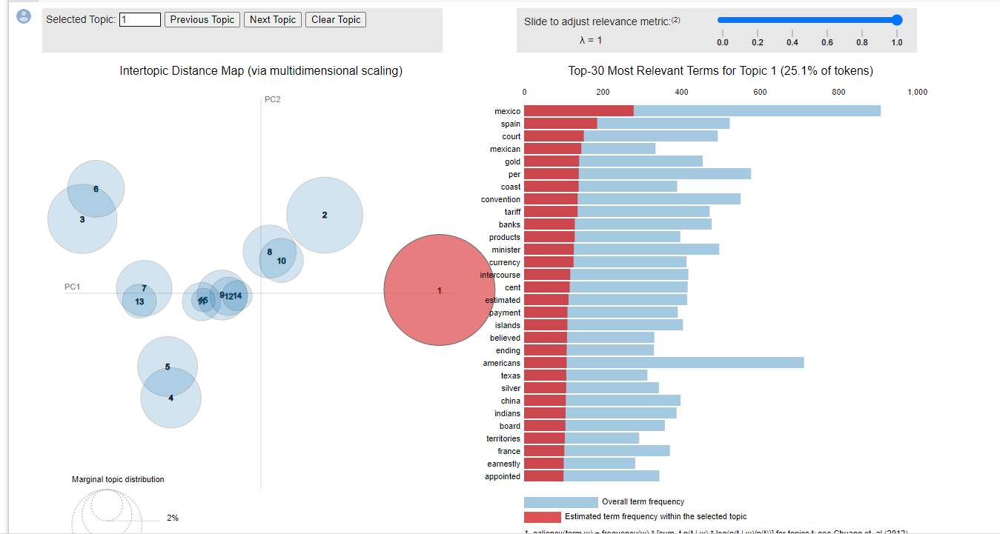

# Gensim Impact


[](https://colab.research.google.com/github/GoldenCorgi/gensim-impact/blob/main/Gensim-Impact.ipynb)




## Why is Topic Modelling not usually used in NLP?
Footnote - Gensim is a Topic Modelling library, utilising Latent Dirichlet allocation

### One liner summary
Gensim is K-Means Cluster for NLP

### Two Liner Summary

Gensim does an unsupervised clustering of topics for many different documents, but all the topics are unlabeled (only indexed) and the number of cluster have to be set beforehand.
This means that by setting 1,200 clusters, there could be 200 clusters on similar topic on cats, but it may be human-unreadable on why there is 200 separation on the same topic of cats

### Longer Summary
```so lets say you have a collection of documents, like articles in a magazine. Now we want to find classify those articles into topics, but we don't know the topics. So ether we decide on a fixed number of topics and clump all the articles that are similar enough together into one topic, or we decide how similar document need to be for them to have their own topic.

Now, how do we know if a document is about one topic or another? well it's based on the words they use, some words can represent a topic. Guess what the topic to these words is: bat, glove, base, homerun, stands. You may guess its baseball but it's just a collection of words, some words can be more relevant then others, like homerun and some words can be in other topics, like glove could be in a fashion topic.

Words make a document those words also make a topic, so that topic information is hidden inside the documents... that information is Latent.

We assume that a document will contain words from more than one topic, but we also assume that one document is mainly about one topic, so many of the words in a document will be about one topic and there won't be very many topics in one document... that's called a Dirichlet distribution.

Now how do we know what words go in what topics? well we don't but we try to guess. We assume that words in a document are usually about one topic and we assume that different words from a topic are usually one document. Then we put all the words into random topics and check if our assumptions hold, we check if the distribution is a Dirichlet distribution. we use the words in the topics to check the words in the documents, and we use the words in the documents to check the words in the topics. If the words don't fit in the topic distribution than we change the topic the word is in. We keep doing that until we notice that we don't change that many words and we kinda say, that's it... and we stop.

now we have a bunch of words in a bunch of topics and we can check if those words are in a document, and if the words are in that document we say that the document is about that topic.

```

https://www.reddit.com/r/MachineLearning/comments/138xep/eli5_latent_dirichlet_allocation_can_you_explain/

## Uses of Topic Modelling

```

It's an interpretable dimensionality reduction of text. "Deep learning" approaches such as word embeddings are generally not interpretable. That's not always a problem (e.g. when the you really only care about end-to-end task performance), but when it's a problem it's a show stopper. It's also computationally simple and stable, and the open source implementations are mature and robust.

```

https://www.reddit.com/r/MachineLearning/comments/5fivcb/d_is_latent_dirichlet_allocation_or_its_offshoots/

https://www.reddit.com/r/MachineLearning/comments/3jhk8n/how_useful_are_topic_models_in_practice/ 


### Alternatives to Gensim / LDA / Topic Modelling as a dimensional reduction technique w explanability

- Matrix Factorisation, see ref: CPF Hackathon 2020
- TF-IDF, see ref: TextRanking


## Overall Evaluation

Don't use Gensim, use a more mature industry-use framework like SpaCY, unless you're in Academic or working in a NLP based company
